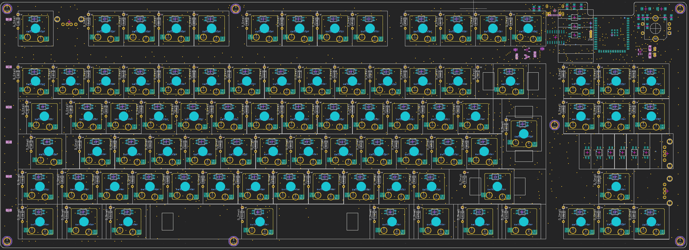
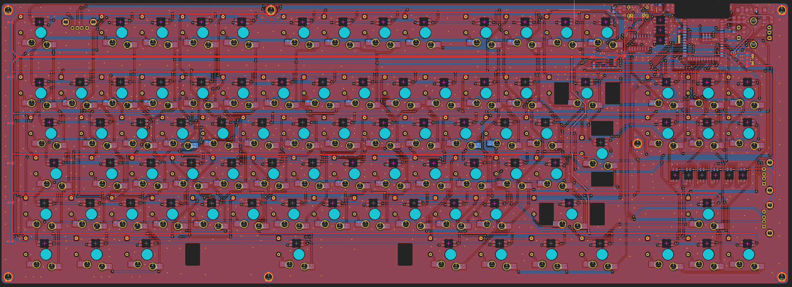

# LowJungle

A low profile, ~65% keyboard, with:

- Hot swappable sockets
- Per key RGB backlight
- Wifi & BLE (but no battery)
- Integrated 3 port USB Hub

## Firmware

For testing: KMK  
For production: QMK

> Circuitpython is soooo much nicer for finding errors in the hardware  
> Status KMK: Pins are correct, keymap is WIP

## PCB

- [x] No relevant ERC & DRC errors
- Size: 371.48mm x 133.35mm
- VCC for backlight LEDs can be controlled by the ESP32 using 2 mosfets
- Used libraries:
  - [Marbastlib, needs to be installed as plugin](https://github.com/ebastler/marbastlib/tree/main)
  - [easyeda2kicad, needs to be installed separately, used for downloading LCSC schematics & footprints](https://github.com/uPesy/easyeda2kicad.py)
    - Download `C2913204, C192893, C2891732, C778164, C2988369, C8547, C503996, C82942` using `easyeda2kicad --full --lcsc_id=<id>` (one-by-one, yes...)
  - `0_Custom`, included in the `libraries` folder, should load automatically

## Parts

**Fasteners:** None - got everything in stock

**PCB:** $36.34 at JLCPCB

**Switches:** [Aliexpress: Gateron KS33 low-profile red, 90 for $38.63 => 0.43 per switch](https://de.aliexpress.com/item/1005007794069535.html)

**Keycaps:** [Aliexpress: Low profile set, 143 lily version, $21.61](https://de.aliexpress.com/item/1005004882406296.html)

**Stabilizers:** [Aliexpress: Gateron low-profile stabilizer set, 4x 2u 1x 6.25u, $13.79](https://de.aliexpress.com/item/1005005296240590.html)

**MCU:**

> Note: The ESP32S3 implementation is the same as in my [Hackpad](https://github.com/hackclub/hackpad/pull/570). Thus the cost can be drastically reduced when combining both LCSC orders:
>
> - -$3: Removed handling fee
> - -$6: Random shipping coupon,
> - and often times the MOQ from hackpad also covers this project

|Name|Price|Link| Needed if combined order ? |
|----|-----|----|----------------------------|
|Espressif Systems ESP32-S3-WROOM-1-N8R2| $4.41| [LCSC](https://www.lcsc.com/product-detail/WiFi-Modules_Espressif-Systems-ESP32-S3-WROOM-1-N8R2_C2913204.html)| Yes|
| N-Channel mosfet | $0.6 for MOQ | [LCSC](https://www.lcsc.com/product-detail/MOSFETs_YONGYUTAI-SI2302_C2891732.html)| Yes |
|3.3V LDO | $0.48 for MOQ| [LCSC](https://www.lcsc.com/product-detail/Voltage-Regulators-Linear-Low-Drop-Out-LDO-Regulators_MICRONE-Nanjing-Micro-One-Elec-ME6211C33M5G-N_C82942.html?s_z=n_ME6211C33M5G-N)| No |
| USB-A female| $0.42 for MOQ | [LCSC](https://www.lcsc.com/product-detail/USB-Connectors_Shenzhen-Kinghelm-Elec-KH-AF90DIP-112_C503996.html?s_z=n_usb%20a)|No |
| USB-C female| $0.4 for MOQ | [LCSC](https://www.lcsc.com/product-detail/USB-Connectors_G-Switch-GT-USB-7010ASV_C2988369.html?s_z=n_G-Switch%20GT-USB-7010asv)|No |
| P-Channel mosfet | $0.49 for MOQ | [LCSC](https://www.lcsc.com/product-detail/MOSFETs_Jiangsu-Changjing-Electronics-Technology-Co-Ltd-CJ2301-S1_C8547.html)|No |
| Mini push button | $0.47 for MOQ | [LCSC](https://www.lcsc.com/product-detail/Tactile-Switches_G-Switch-GT-TC029A-H020-L1N_C778164.html?s_z=n_SKRKAEE020)|No |
| CoreChips SL2.1A USB Hub driver | $1.32 for MOQ | [LCSC](https://www.lcsc.com/product-detail/USB-HUB-Controllers_CoreChips-SL2-1A_C192893.html?s_z=n_C192893)|No |
|---|----|---|---|
| 1N4148 Diodes | $1.04 for 100 | [LCSC](https://www.lcsc.com/product-detail/Switching-Diodes_LangJie-1N4148_C18195411.html?s_z=n_1N4148%2520Diodes) | Yes |
|10uF 0805 Capacitor | $0.16 for MOQ| [LCSC](https://www.lcsc.com/product-detail/Multilayer-Ceramic-Capacitors-MLCC-SMD-SMT_Samsung-Electro-Mechanics-CL21A106KOQNNNE_C1713.html)| No|
| 100nF * | $0.3 for MOQ | [LCSC](https://www.lcsc.com/product-detail/Multilayer-Ceramic-Capacitors-MLCC-SMD-SMT_FH-Guangdong-Fenghua-Advanced-Tech-0805B104J500NT_C29926.html)|No|
| 1uF * | $1 for MOQ | [LCSC](https://www.lcsc.com/product-detail/Multilayer-Ceramic-Capacitors-MLCC-SMD-SMT_YAGEO-CC0805JKX7R9BB105_C541528.html) | No |
|10k 0805 Resistor | $0.13 for MOQ | [LCSC](https://www.lcsc.com/product-detail/Chip-Resistor-Surface-Mount_VO-SCR0805J10K_C5140188.html?s_z=n_resistor)| No|
| 5.1k * | $0.15 for MOQ | [LCSC](https://www.lcsc.com/product-detail/Chip-Resistor-Surface-Mount_UNI-ROYAL-Uniroyal-Elec-0805W8J0512T5E_C26023.html?s_z=n_resistor) | No |
| 100k * |  $0.13 for MOQ | [LCSC](https://www.lcsc.com/product-detail/Chip-Resistor-Surface-Mount_VO-SCR0805J100K_C3017875.html?s_z=n_resistor) | No |

Total (without combined order): $11.46  
Total (with combined order): $6.01

>Note: Combined LCSC order will be around ~$28 (including shipping) for both hackpad and hackboard

**Misc Electronics:**

|Name|Price|Link|
| ----- | ---- | ---- |
| SK6812 MINI-E | $2.85 for 100 | [Aliexpress](https://de.aliexpress.com/item/1005002782417198.html) |
| Gateron Low-profile hot-swap socket | $9.03 for 100 => $0.1 per | [Aliexpress](https://de.aliexpress.com/item/1005008078611488.html?spm=a2g0o.productlist.main.1.3d3470f0o9Li2s&algo_pvid=ef243bac-f923-4f5b-85e0-b6818cdc378c&pdp_ext_f=%7B%22order%22%3A%2223%22%2C%22eval%22%3A%221%22%7D&utparam-url=scene%3Asearch%7Cquery_from%3A) |
| Rotary-encoder | in stock | - |

Total: $11.88

### Total

**Fasteners:** $0  
**PCB:** $36.34  
**Switches:** $38.63  
**Keycaps:** $21.61  
**Stabilizers:** $13.79  
**MCU:** $6.01  
**Misc Electronics:** $11.88  

**Total:** $128.26

> Note: Aliexpress prices are only valid until 26. March (15. anniversary sale)
> => If possible increase grand total by ~$15 if issued after 24. March (some buffer). Unused amount would be returned to HackClub.
